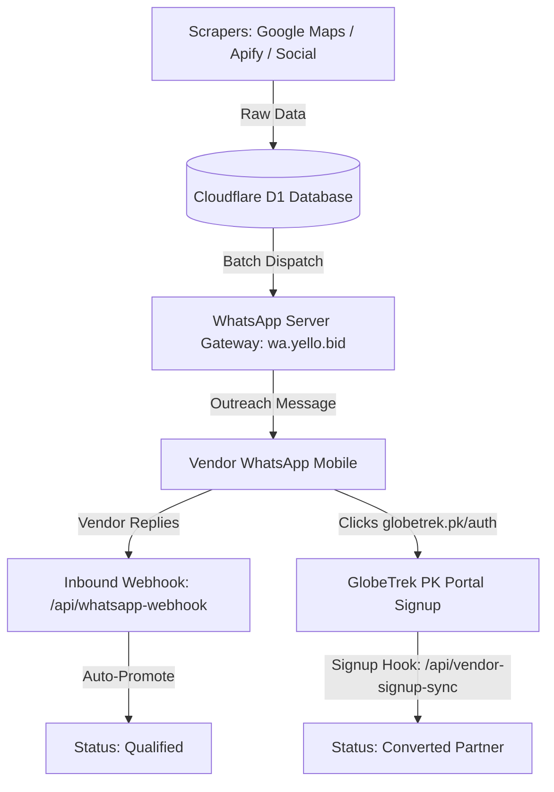

# 🚀 GlobeTrek PK Lead Engine & Outreach Automation Guide

Comprehensive operational guide explaining the **Lead Lifecycle Funnel**, **WhatsApp Outreach Server**, **Automated Webhooks**, and **Inbound Response Tracking**.

---

## 📑 Table of Contents
1. [System Architecture Overview](#1-system-architecture-overview)
2. [The 5-Stage Lead Lifecycle Funnel](#2-the-5-stage-lead-lifecycle-funnel)
3. [Automated Lead Qualification & Conversion Webhooks](#3-automated-lead-qualification--conversion-webhooks)
   - [A. Inbound WhatsApp Reply Webhook (`Auto ➔ Qualified`)](#a-inbound-whatsapp-reply-webhook-auto--qualified)
   - [B. GlobeTrek Vendor Registration Webhook (`Auto ➔ Converted`)](#b-globetrek-vendor-registration-webhook-auto--converted)
4. [Where to View Incoming Vendor Responses](#4-where-to-view-incoming-vendor-responses)
5. [Interactive Testing & Simulation Console](#5-interactive-testing--simulation-console)
6. [Pakistan City-Precision Heatmap](#6-pakistan-city-precision-heatmap)
7. [API Endpoints & Integration Cheat Sheet](#7-api-endpoints--integration-cheat-sheet)

---

## 1. System Architecture Overview



* **Frontend:** React + Tailwind CSS + Vite (Single Page Application).
* **Backend:** Cloudflare Pages Functions (Serverless Edge Workers).
* **Database:** Cloudflare D1 SQL Database (`leads`, `whatsapp_logs`, `scraper_runs`).
* **Live Deployment:** [https://leads-globetrek.pages.dev](https://leads-globetrek.pages.dev)

---

## 2. The 5-Stage Lead Lifecycle Funnel

Every tour operator, hotel, or car rental service moves through 5 distinct statuses:

| Status Badge | Funnel Stage | How It Is Triggered | Meaning |
| :--- | :--- | :--- | :--- |
| **`New`** | Cold Lead | Initial Scrape | Lead is in the database with verified phone/city, but no outreach message has been sent yet. |
| **`WhatsApp Sent`** | Contacted | Batch Outreach Dispatch | An onboarding message was dispatched via the WhatsApp Gateway (`wa.yello.bid`). |
| **`Qualified`** | **Hot Prospect** 🔥 | **Auto on WhatsApp Reply** *(or manual)* | The vendor **replied with positive interest** (e.g. asked about commission, contract, or onboarding steps). |
| **`Converted`** | **Official Partner** 🎉 | **Auto on Portal Signup** *(or manual)* | The operator **completed their vendor registration** at `globetrek.pk/auth?role=vendor`. |
| **`Unresponsive`** | Cold / Stale | Manual / Inactivity | Vendor did not respond after multiple follow-up intervals. |

---

## 3. Automated Lead Qualification & Conversion Webhooks

No manual status updating is required — the system automates both milestones through Webhooks:

### A. Inbound WhatsApp Reply Webhook (`Auto ➔ Qualified`)
* **Endpoint URL:** `https://leads-globetrek.pages.dev/api/whatsapp-webhook`
* **Method:** `POST`
* **Purpose:** Listens for incoming WhatsApp replies forwarded by your WhatsApp Gateway.
* **Payload Example:**
  ```json
  {
    "sender": "+923490386131",
    "message": "Assalam o Alaikum! Yes, please share registration details for our agency."
  }
  ```
* **System Action:**
  1. Matches the phone number against your database.
  2. Upgrades lead status from `WhatsApp Sent` ➔ **`Qualified`**.
  3. Saves the reply message in the lead's notes and adds a record in `whatsapp_logs`.

---

### B. GlobeTrek Vendor Registration Webhook (`Auto ➔ Converted`)
* **Endpoint URL:** `https://leads-globetrek.pages.dev/api/vendor-signup-sync`
* **Method:** `POST`
* **Purpose:** Receives vendor registration events from the GlobeTrek PK portal.
* **Payload Example:**
  ```json
  {
    "phone": "+923490386131",
    "email": "alsaddat@gmail.com",
    "businessName": "Al Saddat Travel and Tour",
    "city": "Abbottabad",
    "projectTag": "Globetrek"
  }
  ```
* **System Action:**
  1. Matches the vendor by phone, email, or business name.
  2. Upgrades lead status from `Qualified` ➔ **`Converted`**.
  3. Stamps their record with a verified partner registration note.

---

## 4. Where to View Incoming Vendor Responses

When a vendor replies, their message is immediately visible in **3 distinct locations**:

### 1. In the **Lead Hub & CSV Export** Table (`/leads`)
Under the business name of any lead that replied, a **purple speech bubble** displays their exact words:
> **💬 Vendor WhatsApp Reply:**
> *"Assalam o Alaikum! Yes, please share registration details for our agency."*

### 2. In **Outreach History Logs & Receipts** (`/outreach-logs`)
* Click the **`📥 Inbound Replies`** filter pill at the top of the table.
* Displays every incoming response with:
  * **Lead / Business Name** & Phone Number
  * **Exact Response Message**
  * **Timestamp**
  * **Badge:** `📥 INBOUND REPLY`

### 3. On the **Analytics Dashboard** (`/dashboard`)
* In the **Recent Leads** table, any lead with an incoming WhatsApp response shows a `💬 [Message Preview]` tag right below their title.

---

## 5. Interactive Testing & Simulation Console

You can test both webhooks with **zero cost and zero waiting**:

1. Open **WhatsApp Server Outreach** ➔ Click the **`Auto-Qualify & Webhook Sync`** sub-tab.
2. In the **Live Automation Simulation Console**:
   * **Pick a Lead:** Select any lead from the dropdown (e.g. *Al Saddat Travel*).
   * **Simulate Vendor Reply:** Type a custom response and click **`[⚡ Simulate Inbound Reply ➔ Auto-Qualify]`**.
   * **Simulate Vendor Signup:** Click **`[🎉 Simulate Portal Signup ➔ Auto-Convert]`**.
3. Watch the lead instantly update to **`Qualified`** or **`Converted`** across the Lead Hub, Map, and KPIs!

---

## 6. Pakistan City-Precision Heatmap

The map widget displays exact GPS hotspots for all scraped Pakistani cities:

* **Outer Radial Ring (Teal):** Total scraped leads in that specific city.
* **Inner Core Pulse (Emerald):** Number of leads that have been **contacted via WhatsApp outreach**.
* **1-Click City Filter:** Clicking any city hotspot (e.g. Lahore, Karachi, Abbottabad) instantly filters the leads table to that exact city.
* **Cities vs. Provinces Toggle:** Switch between high-precision city lists and broader provincial density stats.

---

## 7. API Endpoints & Integration Cheat Sheet

| Endpoint | Method | Auth Required | Description |
| :--- | :--- | :--- | :--- |
| **`/api/whatsapp-webhook`** | `POST` | No (Public Webhook) | Inbound WhatsApp reply handler (promotes lead to `Qualified`). |
| **`/api/vendor-signup-sync`** | `POST` | No (Public Webhook) | GlobeTrek vendor registration hook (promotes lead to `Converted`). |
| **`/api/send-whatsapp`** | `POST` | Bearer Token | Internal proxy to dispatch messages through `wa.yello.bid`. |
| **`/api/leads`** | `GET / POST / DELETE` | Bearer Token | CRUD operations for database leads. |
| **`/api/whatsapp-logs`** | `GET / POST` | Bearer Token | Read/Write audit trail for WhatsApp campaign receipts. |
| **`/api/generate-pitch`** | `POST` | Bearer Token | DeepSeek AI custom pitch generator (Roman Urdu / English). |

---

*Authored for the GlobeTrek PK Core Engineering & Operations Team.*
